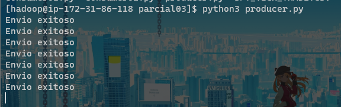
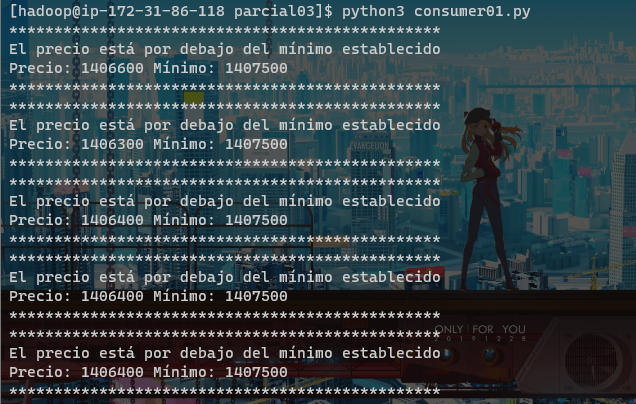
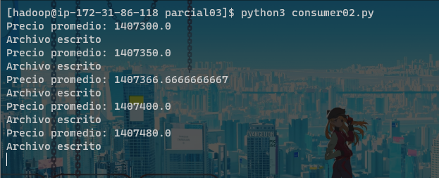

# Parcial 03 - Kafka Streaming
# Por: Valentina Del Pilar Franco y Emmanuel Mora Mosquera
# Universidad Sergio Arboleda

## Requerimientos iniciales
Para la correcta ejecución de estos archivos, es necesario contar con un servidor de Zookeeper y un servidor de Kafka, para ello
se recomienda seguir el siguiente tutorial: [Tutorial Kafka server](https://kafka.apache.org/quickstart)

## [1. producer.py](https://github.com/Hobbit3415/bigData-2022_01/blob/master/corte3/parcial03/producer.py)
El productor se encarga de enviar datos a la cola de Kafka que los consumidores tomarán posteriormente.

Para ello se debe crear un objeto **KafkaProducer** el cual nos permitirá acceder a todos los métodos
de esta clase. Para este caso, el unico parámetro que se establecerá es *bootstrap_servers*. Aquí se establece
la dirección IP del host (servidor de Kafka creado anteriormente) junto con el puerto al cuál debe de conectarse para 
empezar a producir información.

```python3
from kafka import KafkaProducer
import pandas as pd
import time
producer = KafkaProducer(bootstrap_servers=['localhost:9092'])
```
Posteriormente, se lee el dataset desde el cual se tomarán datos para su envío a la cola Kafka
```python3
df = pd.read_csv('https://raw.githubusercontent.com/Hobbit3415/bigData-2022_01/master/SPY_TICK_TRADE.csv')
```
El productor recorrerá cada una de las filas del dataset y enviará el precio al servidor de kafka. Tras cada envió
realizado con éxito, se pondrá a dormir por 4 segundos
```python3
for i in range(len(df['PRICE'])):
  # Extrae el precio del dataset y lo asigna a la variable "precio"
  precio = str(df['PRICE'][i])
  # Codifica el valor obtenido en "utf-8"
  precio = str.encode(precio)
  # Envia el precio al topic "quickstart-events"
  producer.send('quickstart-events',precio)
  print("Envio exitoso")
  # Espera a que los mensajes sean entregados
  producer.flush()
  # Duerme el productor por 4 segundos
  time.sleep(4)
```
### Producer en ejecución



## [2. consumer01.py](https://github.com/Hobbit3415/bigData-2022_01/blob/master/corte3/parcial03/consumer01.py)

Este primero consumidor, tomará los datos enviados a la cola Kafka (precio de la acción de ese día) e imprimirá
una alerta por consola indicando si dicho precio es mayor a 1,408,000 o menor a 1,407,500
> Estos valores se escogieron arbitrariamente

Para este primer consumidor, se deben de importar las siguientes bibliotecas:
```python3
from kafka import KafkaConsumer
import statistics
import boto3
```
Al igual que en el productor, se debe de crear un objeto Kafka, pero esta vez, será un consumidor.
Al consumidor se le deben establecer dos parámetros, el **topic** y el **servidor**.
```python3
consumer = KafkaConsumer("quickstart-events", bootstrap_servers=['localhost:9092'])
# Precios minimos y maximos para generar las alertas por consola
maximo = 1408000
minimo = 1407500
```
Tras establecer el máximo y el mínimo, se debe de leer los precios en la cola Kafka que fueron
enviados por el productor
```python3
for message in consumer:
    precio = int(message[6].decode("utf-8"))
```
Cada mensaje del objeto *consumer* debe ser leido en formato UTF-8.
El mensaje que se lee del consumidor se encuentra en formato JSON, por ende a la variable *precio* se le asigna
la posición 6 puesto que es el luegar donde se almacena el precio
```JSONNasPython
ConsumerRecord(
  topic='quickstart-events',
  partition=0, offset=502, 
  timestamp=1653855841378, 
  timestamp_type=0, 
  key=None, 
  value=b'1406600', 
  headers=[], 
  checksum=None, 
  serialized_key_size=-1, 
  serialized_value_size=7, 
  serialized_header_size=-1
 )
```
Tras almacenar el *precio* de la acción, solo resta establecer el condicional mediante el cual
se imprimirá el mensaje por consola
```python3
if precio > maximo:
        print("************************************************")
        print("El precio está por encima del máximo establecido\nPrecio: {}\tMáximo: {}".format(precio, maximo))
        print("************************************************")

    elif precio < minimo:
        print("************************************************")
        print("El precio está por debajo del mínimo establecido\nPrecio: {}\tMínimo: {}".format(precio, minimo))
        print("************************************************")
```
### Consumer01 en ejecución



## [3. consumer02.py](https://github.com/Hobbit3415/bigData-2022_01/blob/master/corte3/parcial03/consumer02.py)
El segundo consumidor tomará los datos de la cola Kafka y subirá a un bucket en S3 el promedio de precios de las acciones
a medida que los va layendo. Este consumidor tiene la misma estructura que el anterior.
```python3
# Objeto consumer
consumer = KafkaConsumer("quickstart-events", bootstrap_servers=['localhost:9092'])
# Instancia de S3
s3 = boto3.client('s3')
# Sumatoria de los precios
suma = 0
# Contador auxiliar para calcular el promedio
cont = 0
# Lista en la que se almacenaran los precios
precios = list()
# Bucket de destino (debe de cambiarse para replicar el ejercicio"
nombreBucket = 'parcial03'
# Directorio de destino
directory_name = 'precios/'
```

El consumidor recorrerá cada uno de los mensajes leídos en el servidor de Kafka y extraerá
los precios para calcular el promedio de estos a medida que se van agregando a la cola
```python3
# Para cada mensaje en el consumidor...
for message in consumer:
  cont = cont+1
  # Parsea el mensaje
  precio = int(message[6].decode("utf-8"))
  precios.append(precio)
  # Realiza la sumatoria
  suma = suma + precio
  # Calcula el promedio
  promedio = suma/cont
  # Guarda el promedio en una variable string
  txt_data="{}. Promedio = {}".format(cont, str(promedio))
  # Imprime por consola el promedio
  print("Precio promedio: {}".format(str(promedio)))
  print("Archivo escrito")
  # Sube al bucket de S3 el precio promedio en un archivo .txt
  s3.put_object(Body=txt_data, Bucket='parcial03', Key=(directory_name+'precios.txt'))
```
### Consumer 02 en ejecución


